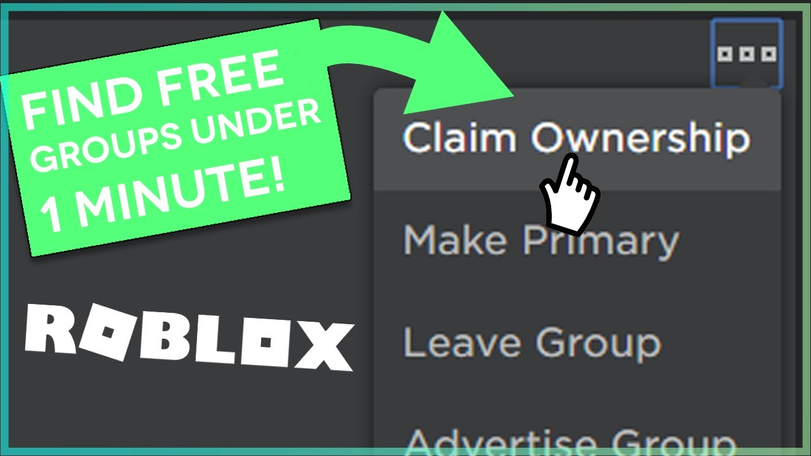

<p align="center">


</p>
<br />
<p align="center">
  <a href="https://github.com/othneildrew/Best-README-Template">
    
  </a>
  
  <h3 align="center">Roblox Group Finder and Checker</h3>

  <p align="center">
    A group finder and checker for all your roblox group needs
    <br />
    <a href="https://github.com/Jakee8718/Roblox-Group-Finder"><strong>Explore the docs »</strong></a>
    <br />
    <br />
    <a href="https://github.com/Jakee8718/Roblox-Group-Finder/issues">Report Bug</a>
    ·
    <a href="https://github.com/Jakee8718/Roblox-Group-Finder/issues">Request Feature</a>
      ·
    <a href="https://discord.gg/qybBqmkcnE">Join the discord</a>
  </p>
</p>
  🥅 ・Goals

・ 10 Stars Faster with better update idk

・ 20  stars Rework all
  
<details open="open">
  <summary>Table of Contents</summary>
  <ol>
    <li>
      <a href="#about-the-project">About The Project</a>
      <ul>
        <li><a href="#built-with">Built With</a></li>
      </ul>
    </li>
    <li>
      <a href="#getting-started">Getting Started</a>
      <ul>
        <li><a href="#prerequisites">Prerequisites</a></li>
        <li><a href="#installation">Installation</a></li>
      </ul>
    </li>
    <li><a href="#usage">Usage</a></li>
    <li><a href="#roadmap">Roadmap</a></li>
    <li><a href="#contributing">Contributing</a></li>
    <li><a href="#copyright">License</a></li>
    <li><a href="#contact">Contact</a></li>
  </ol>
</details>

## About The Project


It "generates" and checks Roblox Group ID's at the same time for maximum efficiency of getting a ownerless group

### Built With

* [Requests](https://github.com/psf/requests)
* [Discord webhook](https://github.com/lovvskillz/python-discord-webhook)
* [Colored](https://gitlab.com/dslackw/colored)

## Getting Started

To get a local copy up and running follow these simple steps.

### Prerequisites
You need to install Python, that can be done [here](https://www.python.org)

### Installation
1. Clone the repo
   ```sh
   git clone https://github.com/Jakee8718/Roblox-Group-Finder.git
   ```
2. Install Python packages
   ```sh
   # Windows:
   py -3 -m pip install -r requirements.txt
   
   # Unix
   python3.8 -m pip install -r requirements.txt
   ```
   
#### Or this can be done using android with unrooted Termux
```
pkg install git
git clone https://github.com/Jakee8718/Roblox-Group-Finder
pkg install python
cd Discord-Nitro-Generator-and-Checker
pip install -r requirements.txt
python3 main.py
```
   
## Usage

Run the `main.py` file using `python main.py` 
The code will show you two prompts:
1.  If you want to use a discord webhook, if you dont know how to get a discord webhook url it is located at   
   ```channel settings » intergrations » webhooks » create webhook```  
   If you dont want to use a webhook simply press enter
2.   How many threads you want
   

The code will start generating and checking after that step


## Roadmap

See the [open issues](https://github.com/Jakee8718/Roblox-Group-Finder/issues) for a list of proposed features (and known issues).

## Contributing

Contributions are what make the open source community such an amazing place to learn and create **greatly appreciated**.

1. Fork the Project
2. Create your Feature Branch (`git checkout -b feature/AmazingFeature`)
3. Commit your Changes (`git commit -m 'Add some AmazingFeature'`)
4. Push to the Branch (`git push origin feature/AmazingFeature`)
5. Open a Pull Request


## Contact

Me - [@daddy m#8718](https://www.discordapp.com) 

Project Link: [https://github.com/Jakee8718/Roblox-Group-Finder(https://github.com/Jakee8718/Roblox-Group-Finder)

<!-- Statistics -->  

<p>

</p>

